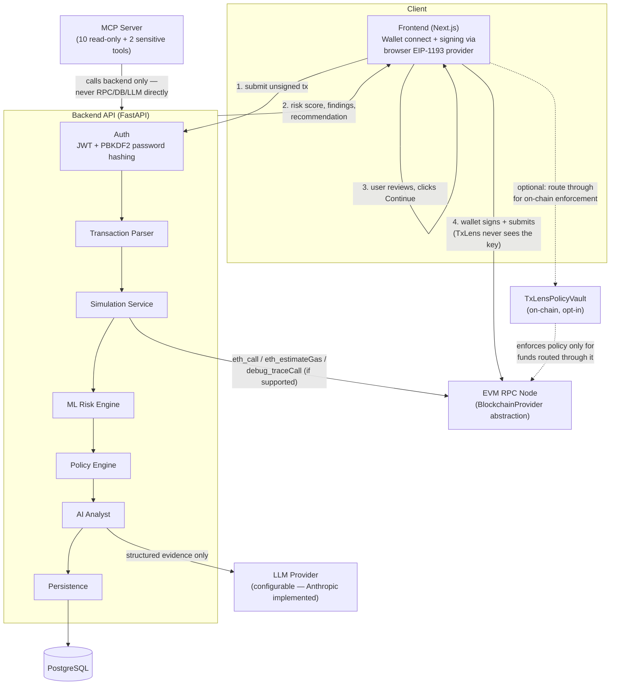

# Architecture

## Component responsibilities

| Layer       | Responsibility                                                                 |
|-------------|----------------------------------------------------------------------------------|
| Blockchain  | Public on-chain state, transaction execution, events, decentralized settlement |
| Contracts   | Enforce policy **only** for transactions routed through TxLens-controlled contracts |
| API         | Orchestrates parsing, simulation, ML, policy, AI, MCP, persistence |
| ML          | Statistical/anomalous risk pattern detection → risk score |
| AI          | Investigates structured evidence, explains risk, recommends action — never invents blockchain facts |
| MCP         | Controlled, audited tools for the AI agent — calls backend services, never RPC/DB directly |
| Frontend    | Sober, professional developer-security UI |

## System diagram



## Request flow (implemented — see docs/roadmap.md for phase history)

```
Wallet connect → submit unsigned tx → auth → parse → simulate (RPC) →
ML risk → policy evaluation → AI investigation → persist to DB →
assessment shown to user → user decides → wallet signs → submit → audit/history
```

Every stage in this flow is implemented in `apps/api/`. Wallet/contract/
token *intelligence* (spec sections 11-13) is intentionally scoped down
to what a plain RPC endpoint can provide (see `app/intelligence/`) —
richer history-based signals need an indexer this project doesn't
integrate.

## Verification status by component

This project was built with no network access and no Docker/Foundry —
verification depth varies genuinely by component, not uniformly:

| Component | Status |
|---|---|
| Parser, blockchain provider, simulation, policy engine, ML risk model, AI analyst logic, MCP tool handlers, auth (password/JWT), input validation | **Executed, passing tests** (162 total) |
| End-to-end pipeline (Parser→Simulation→ML→Policy→AI composed together) | **Executed, passing integration tests** (3) |
| Frontend TypeScript | **Type-checked** with `tsc` (stub ambient types, no real `npm install`) — never run in a browser |
| FastAPI/Pydantic/SQLAlchemy HTTP layer, DB models, persistence, rate limiting, MCP protocol transport, `AnthropicProvider` | **Syntax-checked only** (`py_compile`) — never actually run |
| `TxLensPolicyVault.sol` + Foundry tests | **Not compiled at all** — no `solc`/`forge` available |
| CI workflows, Docker builds | **Not executed** — no GitHub Actions runner or Docker daemon available |

See the root [`README.md`](../README.md) Limitations section for the
full, itemized breakdown of what's real vs. unverified.
